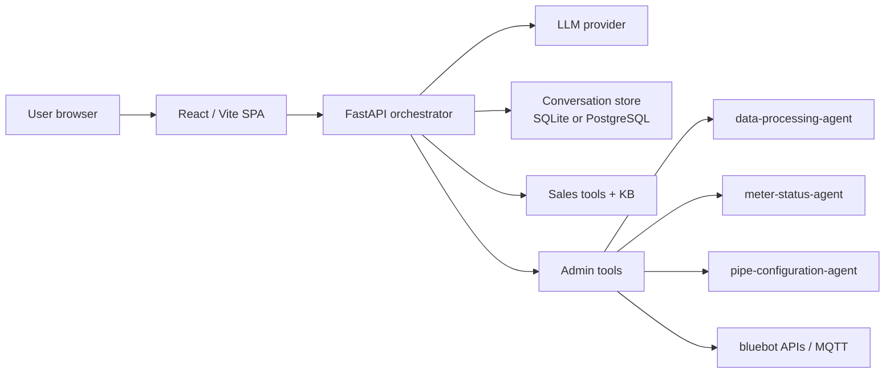

# bluebot meter agent

Conversational AI for bluebot ultrasonic flow meters. This repo contains a **FastAPI** orchestrator, a **React / Vite** web UI, a public pre-login **sales assistant**, an authenticated **admin assistant**, and specialist agents for flow analysis, meter status, and pipe configuration.

The sales assistant helps prospects understand product fit, pipe impact, and installation requirements. The admin assistant supports diagnostics, live meter/account lookups, flow analysis, and pipe configuration workflows.

For line-by-line environment variable comments, see [`.env.example`](.env.example).

---

## Contents

- [Project background](#project-background)
- [Product surfaces](#product-surfaces)
- [UI preview](#ui-preview)
- [Architecture](#architecture)
- [Documentation map](#documentation-map)
- [Quick start](#quick-start)
- [File guide](#file-guide)
- [Testing](#testing)
- [Support](#support)

---

<a id="project-background"></a>

## Project background

bluebot flow-meter users ask two very different kinds of questions:

- **Prospective buyers and installers** need help understanding whether a clamp-on ultrasonic meter fits their pipe, liquid, environment, network, and reporting needs before they ever log in.
- **Internal support/admin users** need authenticated tools for meter diagnostics, flow-history analysis, account lookup, pipe configuration, and operational triage.

This project brings those workflows into one conversational stack while keeping their permissions separate. Public sales chat can educate, qualify, recommend product lines, and create shareable lead context. Authenticated admin chat can call live bluebot systems and specialist analysis agents. The goal is to make product selection and field troubleshooting easier without exposing protected device/account capabilities to public users.

---

<a id="product-surfaces"></a>

## Product surfaces

| Surface | Route | Audience | Auth | Main responsibility |
|---------|-------|----------|------|---------------------|
| **Entry chooser** | `/` | Everyone | No | Lets users choose between Admin and Sales modes before login. |
| **Sales assistant** | `/#/sales` | Prospects, buyers, installers | No | Educates, qualifies leads, recommends product lines, and creates shareable read-only conversation snapshots. |
| **Admin assistant** | `/#/login` then chat | Internal users | Auth0 | Meter diagnostics, flow analysis, account lookup, pipe configuration, and authenticated support workflows. |
| **Shared transcript** | `/#/share/:token` | Anyone with link | No | Read-only snapshot of a selected conversation. |

Sales mode deliberately uses a smaller public tool set. It does **not** expose live bluebot account/device actions or configuration/write tools.

<a id="ui-preview"></a>

## UI preview

<p>
  
</p>

<a id="architecture"></a>

## Architecture



Runtime shape:

- **Development:** Vite serves the frontend on port `5173`/`5174` and proxies `/api` to FastAPI on port `8000`.
- **Docker / Railway:** FastAPI serves both `/api` and the built SPA from one process, listening on `PORT` (default `8080`).
- **Persistence:** conversations use PostgreSQL when `DATABASE_URL` is set; otherwise SQLite is used via `BLUEBOT_CONV_DB` or `orchestrator/conversations.db`.

For the deeper system map, see [docs/architecture.md](docs/architecture.md).

<a id="documentation-map"></a>

## Documentation map

| Need | Read |
|------|------|
| Product surfaces, repo layout, and ownership boundaries | [docs/architecture.md](docs/architecture.md) |
| Public sales assistant behavior, KB, tools, API, and UI persistence | [docs/sales-agent.md](docs/sales-agent.md) |
| Authenticated admin assistant, live tools, and flow/status/pipe sub-agents | [docs/admin-agent.md](docs/admin-agent.md) |
| Local setup, environment variables, Docker, Railway, and database storage | [docs/deployment.md](docs/deployment.md) |
| Test commands and current coverage areas | [docs/testing.md](docs/testing.md) |
| Common setup/runtime failures | [docs/troubleshooting.md](docs/troubleshooting.md) |
| Data-agent template vs LLM rendering experiment | [docs/data-agent-llm-vs-template.md](docs/data-agent-llm-vs-template.md) |

<p>
  
</p>

<a id="quick-start"></a>

## Quick start

Run the **API** and **frontend** in two terminals from `meter_agent/`.

```bash
cp .env.example .env
```

Set the required variables in `.env`, especially Auth0 values for admin login and either `ANTHROPIC_API_KEY` or a browser-provided key. Full environment details are in [docs/deployment.md](docs/deployment.md).

Start the API:

```bash
cd orchestrator
python -m venv .venv
source .venv/bin/activate
pip install -r requirements-api.txt
uvicorn api:app --reload --port 8000 --log-level info
```

Start the frontend:

```bash
cd frontend
npm ci
npm run dev
```

Open the Vite URL, usually [http://localhost:5173](http://localhost:5173). Choose **Sales** for the public assistant or **Admin** for the Auth0-protected assistant.

<a id="file-guide"></a>

## File guide

| If you are changing... | Start here |
|------------------------|------------|
| Sales assistant behavior | [`orchestrator/prompts/sales_system_v1.md`](orchestrator/prompts/sales_system_v1.md), [`orchestrator/sales_agent.py`](orchestrator/sales_agent.py), [`orchestrator/sales_tools.py`](orchestrator/sales_tools.py) |
| Sales KB / product links | [`orchestrator/sales_kb/articles.json`](orchestrator/sales_kb/articles.json), [`orchestrator/sales_kb/product_catalog.json`](orchestrator/sales_kb/product_catalog.json) |
| Sales UI | [`frontend/src/components/SalesChatPage.tsx`](frontend/src/components/SalesChatPage.tsx), [`frontend/src/hooks/useSalesConversations.ts`](frontend/src/hooks/useSalesConversations.ts) |
| Shared chat UI | [`frontend/src/components/ChatView.tsx`](frontend/src/components/ChatView.tsx), [`frontend/src/components/Sidebar.tsx`](frontend/src/components/Sidebar.tsx), [`frontend/src/components/SharePopover.tsx`](frontend/src/components/SharePopover.tsx) |
| API routes | [`orchestrator/api.py`](orchestrator/api.py), [`frontend/src/api.ts`](frontend/src/api.ts) |
| Conversation persistence | [`orchestrator/store.py`](orchestrator/store.py) |
| Admin assistant routing | [`orchestrator/prompts/system_v1.md`](orchestrator/prompts/system_v1.md), [`orchestrator/agent.py`](orchestrator/agent.py), [`orchestrator/tools/`](orchestrator/tools/) |
| Flow analysis internals | [`data-processing-agent/`](data-processing-agent/) |
| Meter status internals | [`meter-status-agent/`](meter-status-agent/) |
| Pipe configuration internals | [`pipe-configuration-agent/`](pipe-configuration-agent/) |
| Tests | [`tests/`](tests/), [`pyproject.toml`](pyproject.toml) |

<a id="testing"></a>

## Testing

```bash
source .venv/bin/activate
pytest -q
```

For first-time test setup, targeted commands, and coverage notes, see [docs/testing.md](docs/testing.md).

<a id="support"></a>

## Support

Internal bluebot tooling; deployment details may vary by environment. Adjust ports, TLS termination, persistence, and secrets per the target host's security policy.

For production setup and Railway notes, start with [docs/deployment.md](docs/deployment.md). For common runtime issues, see [docs/troubleshooting.md](docs/troubleshooting.md).
