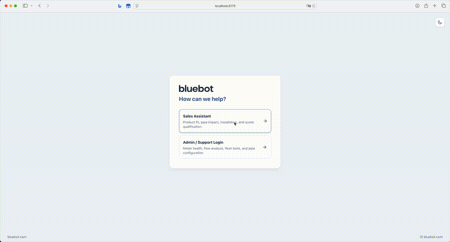
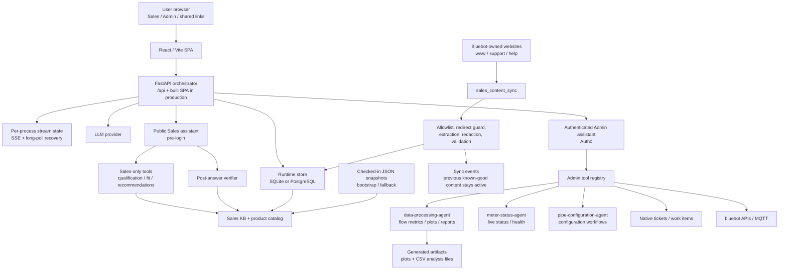

# bluebot meter agent

Conversational AI for bluebot ultrasonic flow meters. This repo contains a **FastAPI** orchestrator, a **React / Vite** web UI, a public pre-login **sales assistant**, an authenticated **admin assistant**, and specialist agents for flow analysis, meter status, and pipe configuration.

The sales assistant helps prospects understand product fit, pipe impact, and installation requirements. The admin assistant supports diagnostics, live meter/account lookups, flow analysis, and pipe configuration workflows.

For line-by-line environment variable comments, see [`.env.example`](.env.example).

---

## Contents

- [Project background](#project-background)
- [Product surfaces](#product-surfaces)
- [UI preview](#ui-preview)
- [Architecture](#architecture)
- [Documentation map](#documentation-map)
- [Quick start](#quick-start)
- [File guide](#file-guide)
- [Testing](#testing)
- [Support](#support)

---

<a id="project-background"></a>

## Project background

bluebot flow-meter users ask two very different kinds of questions:

- **Prospective buyers and installers** need help understanding whether a clamp-on ultrasonic meter fits their pipe, liquid, environment, network, and reporting needs before they ever log in.
- **Internal support/admin users** need authenticated tools for meter diagnostics, flow-history analysis, account lookup, pipe configuration, and operational triage.

This project brings those workflows into one conversational stack while keeping their permissions separate. Public sales chat can educate, qualify, recommend product lines, and create shareable lead context. Authenticated admin chat can call live bluebot systems and specialist analysis agents. The goal is to make product selection and field troubleshooting easier without exposing protected device/account capabilities to public users.

---

<a id="product-surfaces"></a>

## Product surfaces

| Surface | Route | Audience | Auth | Main responsibility |
|---------|-------|----------|------|---------------------|
| **Entry chooser** | `/` | Everyone | No | Lets users choose between Admin and Sales modes before login. |
| **Sales assistant** | `/#/sales` | Prospects, buyers, installers | No | Educates, qualifies leads, recommends product lines, and creates shareable read-only conversation snapshots. |
| **Admin assistant** | `/#/login` then chat | Internal users | Auth0 | Meter diagnostics, flow analysis, account lookup, pipe configuration, and authenticated support workflows. |
| **Shared transcript** | `/#/share/:token` | Anyone with link | No | Read-only snapshot of a selected conversation. |

Sales mode deliberately uses a smaller public tool set. It does **not** expose live bluebot account/device actions or configuration/write tools.

<a id="ui-preview"></a>

## UI preview

<p>
  
</p>

<a id="architecture"></a>

## Architecture

### Current runtime

The repo currently runs as one product stack: the React/Vite UI talks to one FastAPI orchestrator, and the orchestrator chooses either the public Sales assistant or the authenticated Admin assistant. The durable state path is shared, but permissions and tool access are intentionally split.



### Runtime boundaries

- **Public vs admin:** Sales chat is pre-login and can only call sales-only tools. Admin chat is Auth0-protected and owns live meter/account lookup, flow analysis, pipe configuration, MQTT-related actions, and tickets.
- **No live browsing during chat:** the Sales assistant reads reviewed/runtime records. Website refresh happens through `orchestrator.sales_content_sync`, not during a customer turn.
- **Evidence-aware sales validation:** general Sales replies use a rough deterministic check by default, while product, pipe-fit, installation, support, pricing/package, connectivity, recommendation, and capability claims escalate to the stronger verifier.
- **Durable state:** `store.py` persists conversations, public sales conversations, share snapshots, tickets, sales content records, and sync events in PostgreSQL when `DATABASE_URL` is set, otherwise SQLite.
- **Ephemeral state:** active stream sessions, cancellation flags, and per-process turn limits live in the FastAPI process. Generated plots/CSV artifacts are files under `PLOTS_DIR` / `BLUEBOT_ANALYSES_DIR`.
- **Backpressure:** `ORCHESTRATOR_MAX_CONCURRENT_TURNS` limits simultaneous model turns per API process. Admin tools also dedupe/cache some read calls within a turn and parallelize safe read-only work.

### Sales content refresh

The Sales assistant can start from checked-in JSON files and still work with an empty database. When synced records exist, `sales_chat/tools.py` merges DB records over those snapshots.

`orchestrator.sales_content_sync` fetches only `www.bluebot.com`, `support.bluebot.com`, and `help.bluebot.com`, rejects off-domain redirects, extracts readable text, redacts pricing/package wording, validates records, and writes only valid content. Failed fetches or validation errors are logged without overwriting previous known-good records.

Manual refresh:

```bash
python -m orchestrator.sales_content_sync --run-once
```

Without `--run-once`, the same entrypoint runs as a daily loop by default.

Runtime shape:

- **Development:** Vite serves the frontend on port `5173`/`5174` and proxies `/api` to FastAPI on port `8000`.
- **Docker / Railway:** FastAPI serves both `/api` and the built SPA from one process, listening on `PORT` (default `8080`).
- **Persistence:** conversations use PostgreSQL when `DATABASE_URL` is set; otherwise SQLite is used via `BLUEBOT_CONV_DB` or `orchestrator/conversations.db`.

### Scaling path

| Pressure | Current behavior | Scale-up move |
|----------|------------------|---------------|
| More concurrent chats | Per-process stream memory plus `ORCHESTRATOR_MAX_CONCURRENT_TURNS`; SQLite is single-node friendly, Postgres is available. | Move hosted deployments to Postgres first. Add sticky routing for in-flight streams, or move stream events/cancellation state to Redis/pub-sub before running multiple API replicas. |
| Heavy flow analysis and fleet triage | Long-running work starts from the API process and may spawn subprocesses/worker threads. | Put expensive analyses behind a job queue with separate workers; keep the API focused on request routing, auth, and stream/event delivery. |
| Generated plots and CSV artifacts | Files are served from local `PLOTS_DIR` / `BLUEBOT_ANALYSES_DIR`. | Use a shared volume for one-region deployments or object storage with authenticated/signed URLs for multi-replica deployments. |
| Sales website refresh | The sync entrypoint can run as a daily loop and writes known-good records to the DB. | Run content sync as a singleton cron/worker so multiple API replicas do not duplicate crawls or race on freshness. |
| LLM and bluebot API limits | Turn limiting and token budgeting are per process; some tools parallelize reads. | Add a shared rate limiter and queue-level backpressure across replicas; track per-surface quotas so public Sales traffic cannot starve Admin support workflows. |
| Operational visibility | SSE events, sync events, tests, and logs exist, but most coordination is process-local. | Add structured metrics/tracing for turn latency, tool latency, verifier rewrites, queue depth, artifact failures, and upstream API errors. |

A practical scale-up order is: Postgres for all hosted state, shared/object artifact storage, sticky routing or shared stream state, background workers for heavy tools and content sync, then horizontal API replicas. Splitting Sales and Admin into separately scaled services can come later if traffic or security policy makes that worth the extra operational surface area.

For the deeper system map, see [docs/architecture.md](docs/architecture.md).

<a id="documentation-map"></a>

## Documentation map

| Need | Read |
|------|------|
| Product surfaces, repo layout, and ownership boundaries | [docs/architecture.md](docs/architecture.md) |
| Public sales assistant behavior, KB, tools, API, and UI persistence | [docs/sales-agent.md](docs/sales-agent.md) |
| Authenticated admin assistant, live tools, and flow/status/pipe sub-agents | [docs/admin-agent.md](docs/admin-agent.md) |
| Local setup, environment variables, Docker, Railway, and database storage | [docs/deployment.md](docs/deployment.md) |
| Test commands and current coverage areas | [docs/testing.md](docs/testing.md) |
| Common setup/runtime failures | [docs/troubleshooting.md](docs/troubleshooting.md) |
| Data-agent template vs LLM rendering experiment | [docs/data-agent-llm-vs-template.md](docs/data-agent-llm-vs-template.md) |

<p>
  
</p>

<a id="quick-start"></a>

## Quick start

Run from the `meter_agent/` directory.

```bash
cp .env.example .env
```

Set the required variables in `.env`, especially Auth0 values for admin login and either `ANTHROPIC_API_KEY` or a browser-provided key. Full environment details are in [docs/deployment.md](docs/deployment.md).

Start both servers with the wrapper:

```bash
./run_project.sh --reload
```

Or start them separately in two terminals:

```bash
./run_backend.sh --reload
```

```bash
./run_frontend.sh
```

Open the Vite URL, usually [http://localhost:5173](http://localhost:5173). Choose **Sales** for the public assistant or **Admin** for the Auth0-protected assistant.

<a id="file-guide"></a>

## File guide

| If you are changing... | Start here |
|------------------------|------------|
| Sales assistant behavior | [`orchestrator/prompts/sales_system_v1.md`](orchestrator/prompts/sales_system_v1.md), [`orchestrator/sales_chat/agent.py`](orchestrator/sales_chat/agent.py), [`orchestrator/sales_chat/tools.py`](orchestrator/sales_chat/tools.py) |
| Sales KB / product links | [`orchestrator/sales_chat/content_sync.py`](orchestrator/sales_chat/content_sync.py), [`orchestrator/sales_content_sync.py`](orchestrator/sales_content_sync.py), [`orchestrator/sales_kb/articles.json`](orchestrator/sales_kb/articles.json), [`orchestrator/sales_kb/product_catalog.json`](orchestrator/sales_kb/product_catalog.json) |
| Sales UI | [`frontend/src/features/sales/SalesChatPage.tsx`](frontend/src/features/sales/SalesChatPage.tsx), [`frontend/src/hooks/useSalesConversations.ts`](frontend/src/hooks/useSalesConversations.ts) |
| Shared chat UI | [`frontend/src/features/chat/components/ChatView.tsx`](frontend/src/features/chat/components/ChatView.tsx), [`frontend/src/features/conversations/components/Sidebar.tsx`](frontend/src/features/conversations/components/Sidebar.tsx), [`frontend/src/features/share/components/SharePopover.tsx`](frontend/src/features/share/components/SharePopover.tsx) |
| API routes | [`orchestrator/server/app.py`](orchestrator/server/app.py), [`orchestrator/server/routers/`](orchestrator/server/routers/), [`orchestrator/api.py`](orchestrator/api.py), [`frontend/src/api/client.ts`](frontend/src/api/client.ts) |
| Conversation persistence | [`orchestrator/persistence/`](orchestrator/persistence/), [`orchestrator/store.py`](orchestrator/store.py) |
| Admin assistant routing | [`orchestrator/prompts/system_v1.md`](orchestrator/prompts/system_v1.md), [`orchestrator/admin_chat/`](orchestrator/admin_chat/), [`orchestrator/agent.py`](orchestrator/agent.py), [`orchestrator/tools/`](orchestrator/tools/) |
| Shared orchestrator helpers | [`orchestrator/shared/`](orchestrator/shared/) |
| Flow analysis internals | [`data-processing-agent/`](data-processing-agent/) |
| Meter status internals | [`meter-status-agent/`](meter-status-agent/) |
| Pipe configuration internals | [`pipe-configuration-agent/`](pipe-configuration-agent/) |
| Tests | [`tests/`](tests/), [`pyproject.toml`](pyproject.toml) |

<a id="testing"></a>

## Testing

```bash
source .venv/bin/activate
pytest -q
```

For first-time test setup, targeted commands, and coverage notes, see [docs/testing.md](docs/testing.md).

<a id="support"></a>

## Support

Internal bluebot tooling; deployment details may vary by environment. Adjust ports, TLS termination, persistence, and secrets per the target host's security policy.

For production setup and Railway notes, start with [docs/deployment.md](docs/deployment.md). For common runtime issues, see [docs/troubleshooting.md](docs/troubleshooting.md).
