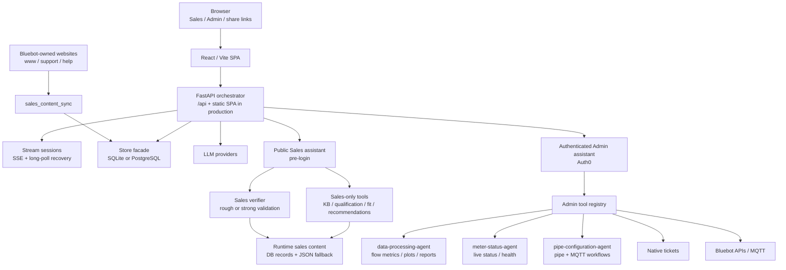

# Architecture

This document explains the runtime shape, ownership boundaries, and scaling direction for the meter-agent stack. Use it as the system map before changing frontend structure, backend orchestration, persistence, streaming, or public/admin assistant behavior.

## Contents

- [Runtime shape](#runtime-shape)
- [Product surfaces](#product-surfaces)
- [Frontend architecture](#frontend-architecture)
- [Backend architecture](#backend-architecture)
- [Turn lifecycle and state](#turn-lifecycle-and-state)
- [Repository layout](#repository-layout)
- [File guide by task](#file-guide-by-task)
- [Boundary rules](#boundary-rules)
- [Scaling direction](#scaling-direction)

## Runtime shape

The app is one product stack with two assistant surfaces. The React/Vite SPA talks to one FastAPI orchestrator. The orchestrator routes each turn to either the public Sales assistant or the authenticated Admin assistant, while keeping their tools and permissions separate.

- **Development:** Vite serves the frontend on port `5173` or `5174` and proxies `/api` to FastAPI on port `8000`.
- **Production / Railway:** FastAPI serves both `/api` and the built SPA from one process, listening on `PORT` with a default of `8080`.
- **Persistence:** conversations use PostgreSQL when `DATABASE_URL` is set. Otherwise SQLite is used via `BLUEBOT_CONV_DB` or `orchestrator/conversations.db`.
- **LLM access:** the server can use `ANTHROPIC_API_KEY`; users can also paste a browser-local key that is sent as `X-Anthropic-Key`.

## Product surfaces

| Surface | Route | Audience | Auth | Responsibility |
|---------|-------|----------|------|----------------|
| Entry chooser | `/` | Everyone | No | Sends users to Admin or Sales before login. |
| Sales assistant | `/#/sales` | Prospects, buyers, installers | No | Qualification, product fit, installation education, links, and lead summary. |
| Admin assistant | `/#/login` then chat | Internal users | Auth0 | Live meter/account diagnostics, flow analysis, pipe configuration, and support workflows. |
| Shared transcript | `/#/share/:token` | Anyone with link | No | Read-only conversation snapshot. |

The important product rule is separation by capability, not just by UI route: Sales can educate and qualify, while Admin can touch protected device/account systems.

## Frontend architecture

The frontend is organized by stable layers:

| Layer | Path | Responsibility |
|-------|------|----------------|
| API client | [`../frontend/src/api/`](../frontend/src/api/) | HTTP/SSE/long-poll calls and typed API helpers. |
| App shell | [`../frontend/src/app/`](../frontend/src/app/) | Top-level route/mode composition. |
| Core | [`../frontend/src/core/`](../frontend/src/core/) | Pure chat stream reducer, turn activity model, config compatibility, artifact parsing, shared domain types. |
| Features | [`../frontend/src/features/`](../frontend/src/features/) | UI grouped by product concern: auth, branding, chat, conversations, feedback, meter workspace, sales, share, theme. |
| Hooks | [`../frontend/src/hooks/`](../frontend/src/hooks/) | Shared stateful behavior for admin chat, conversation lists, virtual windows, media queries, and sales conversation lists. |
| Utils | [`../frontend/src/utils/`](../frontend/src/utils/) | Small cross-feature helpers such as transcript cleanup and PDF export. |

The key frontend design constraint is **shared chat parity**. Admin and Sales should use the same chat primitives whenever the behavior is conceptually the same:

- [`../frontend/src/features/chat/components/ChatView.tsx`](../frontend/src/features/chat/components/ChatView.tsx) renders the transcript, composer, running state, streaming assistant bubble, stop button, artifacts, and tickets/workspace panels where applicable.
- [`../frontend/src/core/chatStreamReducer.ts`](../frontend/src/core/chatStreamReducer.ts) consumes stream events and produces a common live state shape.
- [`../frontend/src/core/turnActivity.ts`](../frontend/src/core/turnActivity.ts) converts backend events into the status timeline shown during and after a turn.
- Sales owns public-conversation creation, browser-held conversation ids, lead-summary UI, and public share flows in [`../frontend/src/features/sales/SalesChatPage.tsx`](../frontend/src/features/sales/SalesChatPage.tsx).

When adding a new assistant-like surface, prefer reusing the shared chat reducer, `ChatView`, turn activity timeline, sidebar, share components, and stream recovery behavior before introducing another parallel chat UI.

## Backend architecture

The backend is a Python orchestrator with compatibility facades at the top level and clearer ownership underneath.

| Layer | Path | Responsibility |
|-------|------|----------------|
| HTTP server | [`../orchestrator/server/`](../orchestrator/server/) | FastAPI app, request models, route facades, stream state, cancellation, static SPA serving. |
| Admin chat | [`../orchestrator/admin_chat/`](../orchestrator/admin_chat/) | Authenticated turn loop, intent routing, tool dispatch, history budgeting, config confirmations, admin meter-tool adapters. |
| Sales chat | [`../orchestrator/sales_chat/`](../orchestrator/sales_chat/) | Public sales prompt runner, sales-only tools, verifier, content sync implementation. |
| Shared runtime | [`../orchestrator/shared/`](../orchestrator/shared/) | Base agent wrapper, message sanitization, observability, plot paths, subprocess env, summarizer, tool registry, TPM window, turn gate. |
| Persistence | [`../orchestrator/persistence/`](../orchestrator/persistence/) | DB bootstrap and storage domains for conversations, tickets, shares, sales content, and evidence. |
| Compatibility facades | [`../orchestrator/api.py`](../orchestrator/api.py), [`../orchestrator/agent.py`](../orchestrator/agent.py), [`../orchestrator/store.py`](../orchestrator/store.py), [`../orchestrator/sales_content_sync.py`](../orchestrator/sales_content_sync.py) | Stable imports/entrypoints for scripts, tests, and deployment commands. |

The compatibility facades are intentional. New code should usually import the clearer package modules, but old local commands such as `uvicorn api:app` should keep working.

## Turn lifecycle and state

Admin and Sales turns follow the same high-level streaming pattern:

1. The browser POSTs a message with a client-generated `turn_id`.
2. FastAPI creates a stream session with an append-only event log, marks the conversation active, and starts a worker thread.
3. The browser consumes events through SSE, with long-poll fallback/recovery for refreshes and mobile browsers.
4. Events update the shared frontend stream reducer and turn-activity timeline.
5. On completion, the backend persists new messages and attaches a slim `turn_activity` block to the final assistant message so process status can be replayed after refresh or conversation switch.

State is deliberately split:

| State | Owner | Notes |
|-------|-------|-------|
| Conversation messages, titles, tickets, sales lead summaries, shares, sales content | Database via [`../orchestrator/store.py`](../orchestrator/store.py) | Durable across reloads and deployments when Postgres or volume-backed SQLite is used. |
| In-flight stream sessions, event logs, cancellation events, active conversation ids | FastAPI process memory | Good for local/single-process deployments; needs sticky routing or shared stream state before horizontal API scaling. |
| Live frontend stream state | Browser session storage + React state | Lets the UI survive route switches and recover from refresh while the server is still processing. |
| Generated plots and analysis bundles | Local files under `PLOTS_DIR` / `BLUEBOT_ANALYSES_DIR` | Needs shared volume or object storage for multi-replica deployments. |

Sales answers have one extra safety step: drafts are validated before display. General greetings and clarification replies use rough deterministic validation by default. Product, pipe-fit, compatibility, installation, support, pricing/package, connectivity, recommendation, evidence-tool, or capability claims escalate to the stronger verifier.

## Repository layout

| Path | Role |
|------|------|
| [`../orchestrator/`](../orchestrator/) | Backend orchestration package; flat `api.py`, `agent.py`, and `store.py` remain compatibility facades. |
| [`../orchestrator/server/`](../orchestrator/server/) | FastAPI app implementation, stream state, request models, route-group facades. |
| [`../orchestrator/admin_chat/`](../orchestrator/admin_chat/) | Authenticated admin turn loop plus intent, tool-dispatch, history-budget, and confirmation boundaries. |
| [`../orchestrator/sales_chat/`](../orchestrator/sales_chat/) | Public sales turn loop, sales-only tools, verifier, and website content sync internals. |
| [`../orchestrator/shared/`](../orchestrator/shared/) | Cross-cutting runtime helpers shared by admin, sales, and server code. |
| [`../orchestrator/persistence/`](../orchestrator/persistence/) | SQLite/Postgres persistence implementation and domain facades for conversations, tickets, shares, sales content, and evidence. |
| [`../frontend/`](../frontend/) | React + TypeScript SPA; Vite dev server proxies `/api`. |
| [`../data-processing-agent/`](../data-processing-agent/) | Flow history fetch, deterministic processors, plots, verified metrics, reports. |
| [`../meter-status-agent/`](../meter-status-agent/) | Live status/client-health subprocess used by admin mode. |
| [`../pipe-configuration-agent/`](../pipe-configuration-agent/) | Pipe setup and MQTT-related workflows used by admin mode. |
| [`../tests/`](../tests/) | Pytest and frontend coverage for processors, tools, prompts, routes, reducers, and store behavior. |
| [`../docs/`](../docs/) | Focused documentation pages; root README stays as the onboarding entry. |

Root [`../package.json`](../package.json) exists for semantic-release in CI only. Runtime is Python plus the built frontend inside Docker.

## File guide by task

| If you are changing... | Start here | Notes |
|------------------------|------------|-------|
| Public sales assistant behavior | [`../orchestrator/prompts/sales_system_v1.md`](../orchestrator/prompts/sales_system_v1.md), [`../orchestrator/sales_chat/agent.py`](../orchestrator/sales_chat/agent.py), [`../orchestrator/sales_chat/tools.py`](../orchestrator/sales_chat/tools.py) | Sales mode has its own prompt, tool allowlist, KB search, lead qualification, product recommendation logic, and post-answer verifier. |
| Sales knowledge base / product links | [`../orchestrator/sales_chat/content_sync.py`](../orchestrator/sales_chat/content_sync.py), [`../orchestrator/sales_content_sync.py`](../orchestrator/sales_content_sync.py), [`../orchestrator/sales_kb/articles.json`](../orchestrator/sales_kb/articles.json), [`../orchestrator/sales_kb/product_catalog.json`](../orchestrator/sales_kb/product_catalog.json) | V1 uses curated local/runtime content instead of live browsing during chat. |
| Public sales UI | [`../frontend/src/features/sales/SalesChatPage.tsx`](../frontend/src/features/sales/SalesChatPage.tsx), [`../frontend/src/hooks/useSalesConversations.ts`](../frontend/src/hooks/useSalesConversations.ts) | Reuses shared admin UI pieces for sidebar, history, status, stop button, and share links. |
| Shared chat UI components | [`../frontend/src/features/chat/components/ChatView.tsx`](../frontend/src/features/chat/components/ChatView.tsx), [`../frontend/src/core/chatStreamReducer.ts`](../frontend/src/core/chatStreamReducer.ts), [`../frontend/src/core/turnActivity.ts`](../frontend/src/core/turnActivity.ts) | Keep admin and sales behavior visually aligned here. |
| Public/authenticated API routes | [`../orchestrator/server/app.py`](../orchestrator/server/app.py), [`../orchestrator/server/routers/`](../orchestrator/server/routers/), [`../frontend/src/api/client.ts`](../frontend/src/api/client.ts) | `../orchestrator/api.py` is a compatibility facade for `uvicorn api:app`; public sales routes live under `/api/public/sales/...`; authenticated admin routes live under `/api/conversations/...`. |
| Conversation persistence | [`../orchestrator/persistence/`](../orchestrator/persistence/), [`../orchestrator/store.py`](../orchestrator/store.py) | `store.py` remains the stable flat import; persistence modules separate DB bootstrap, conversations, tickets, shares, sales content, and evidence. |
| Admin assistant prompt / routing | [`../orchestrator/prompts/system_v1.md`](../orchestrator/prompts/system_v1.md), [`../orchestrator/admin_chat/`](../orchestrator/admin_chat/), [`../orchestrator/agent.py`](../orchestrator/agent.py), [`../orchestrator/tools/`](../orchestrator/tools/) | `agent.py` remains the stable flat import; admin-chat modules separate turn loop, intent routing, tool dispatch, history budgeting, and confirmation helpers. |
| Shared orchestrator runtime helpers | [`../orchestrator/shared/`](../orchestrator/shared/) | Cross-cutting helpers for title summarization, message sanitization, observability, TPM budgeting, subprocess env, plot paths, and tool registry primitives. |
| Flow analysis internals | [`../data-processing-agent/`](../data-processing-agent/) | Deterministic processors, plots, verified metrics, and report generation. |
| Meter status internals | [`../meter-status-agent/`](../meter-status-agent/) | Live status/client health and health-score logic. |
| Pipe configuration internals | [`../pipe-configuration-agent/`](../pipe-configuration-agent/) | Pipe setup and MQTT-related workflows. |
| Deployment | [`../Dockerfile`](../Dockerfile), [`../.env.example`](../.env.example), [deployment.md](deployment.md) | Railway uses the same Docker image as local production-style Docker. |
| Tests | [`../tests/`](../tests/), [`../pyproject.toml`](../pyproject.toml), [testing.md](testing.md) | Sales-agent tests live in [`../tests/orchestrator/test_sales_agent.py`](../tests/orchestrator/test_sales_agent.py). |

## Boundary rules

- Public sales chat stays pre-login and should never expose live bluebot account/device data.
- Sales mode uses curated/runtime sales content and sales-only tools; it should not call admin tools or browse live websites during a customer turn.
- Admin mode owns live diagnostics, account lookups, flow analysis, status checks, pipe configuration, tickets, and MQTT-related workflows.
- Shared UI components should preserve visual parity between admin and sales unless a product requirement explicitly diverges.
- Conversation storage belongs behind [`../orchestrator/store.py`](../orchestrator/store.py) / [`../orchestrator/persistence/`](../orchestrator/persistence/), not in frontend-only state, because reloads and Railway deployments need durable state.
- Process status belongs in stream events and `turn_activity` blocks; assistant prose should stay user-facing and should not narrate internal tool/function/module names.
- Top-level compatibility facades should remain thin. New implementation should live in `admin_chat`, `sales_chat`, `shared`, `server`, or `persistence` as appropriate.

## Scaling direction

The current architecture is intentionally simple for local development and a single hosted service. Scale it in this order:

| Pressure | Current behavior | Next scaling move |
|----------|------------------|-------------------|
| More durable hosted state | SQLite works locally; Postgres is available through `DATABASE_URL`. | Use Postgres for hosted deployments before adding replicas. |
| More concurrent chats | Stream sessions, cancellation, and turn limits are process-local. | Add sticky routing for in-flight streams, or move stream events/cancellation state to Redis/pub-sub before running multiple API replicas. |
| Heavy flow analysis or fleet triage | The API process starts subprocess/worker-thread work. | Move expensive analyses to a job queue with dedicated workers; keep the API focused on auth, routing, and event delivery. |
| Generated plots and CSV artifacts | Files live under local `PLOTS_DIR` / `BLUEBOT_ANALYSES_DIR`. | Use a shared volume for one-region deployments, or object storage with signed/authenticated URLs for multi-replica deployments. |
| Sales website refresh | `sales_content_sync` can run as a local daily loop. | Run sync as a singleton cron/worker so replicas do not duplicate crawls or race on freshness. |
| Provider and Bluebot API limits | Token budgeting and model-turn limits are mostly per process. | Add shared rate limiting and queue-level backpressure across replicas; keep public Sales traffic from starving Admin support workflows. |
| Operational visibility | Logs, tests, stream events, and sync events exist. | Add metrics/tracing for queue depth, turn latency, tool latency, verifier rewrites, sync freshness, artifact generation, and upstream API errors. |

Only split Sales and Admin into separately deployed services after the shared service has outgrown process-local coordination or security policy requires stricter isolation. Until then, keep the shared UI, shared stream protocol, and shared persistence facade aligned so both surfaces improve together.
