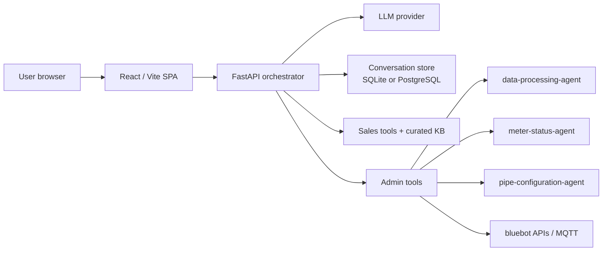

# Architecture

This document explains the main runtime surfaces, repo boundaries, and where to start when changing a specific part of the meter-agent stack.

## Contents

- [Runtime shape](#runtime-shape)
- [Product surfaces](#product-surfaces)
- [Repository layout](#repository-layout)
- [File guide by task](#file-guide-by-task)
- [Boundary rules](#boundary-rules)

## Runtime shape

- **Development:** Vite serves the frontend on port `5173` or `5174` and proxies `/api` to FastAPI on port `8000`.
- **Production / Railway:** FastAPI serves both `/api` and the built SPA from one process, listening on `PORT` with a default of `8080`.
- **Persistence:** conversations use PostgreSQL when `DATABASE_URL` is set. Otherwise SQLite is used via `BLUEBOT_CONV_DB` or `orchestrator/conversations.db`.
- **LLM access:** the server can use `ANTHROPIC_API_KEY`; users can also paste a browser-local key that is sent as `X-Anthropic-Key`.

## Product surfaces

| Surface | Route | Audience | Auth | Responsibility |
|---------|-------|----------|------|----------------|
| Entry chooser | `/` | Everyone | No | Sends users to Admin or Sales before login. |
| Sales assistant | `/#/sales` | Prospects, buyers, installers | No | Qualification, product fit, installation education, links, and lead summary. |
| Admin assistant | `/#/login` then chat | Internal users | Auth0 | Live meter/account diagnostics, flow analysis, pipe configuration, and support workflows. |
| Shared transcript | `/#/share/:token` | Anyone with link | No | Read-only conversation snapshot. |

## Repository layout

| Path | Role |
|------|------|
| [`../orchestrator/`](../orchestrator/) | Backend orchestration package; flat `api.py`, `agent.py`, and `store.py` remain compatibility facades |
| [`../orchestrator/server/`](../orchestrator/server/) | FastAPI app implementation, stream state, request models, route-group facades |
| [`../orchestrator/admin_chat/`](../orchestrator/admin_chat/) | Authenticated admin turn loop plus intent, tool-dispatch, history-budget, and confirmation boundaries |
| [`../orchestrator/persistence/`](../orchestrator/persistence/) | SQLite/Postgres persistence implementation and domain facades for conversations, tickets, shares, sales content, and evidence |
| [`../frontend/`](../frontend/) | React + TypeScript SPA; Vite dev server proxies `/api` |
| [`../data-processing-agent/`](../data-processing-agent/) | Flow history fetch, deterministic processors, plots, verified metrics, reports |
| [`../meter-status-agent/`](../meter-status-agent/) | Live status/client-health subprocess used by admin mode |
| [`../pipe-configuration-agent/`](../pipe-configuration-agent/) | Pipe setup and MQTT-related workflows used by admin mode |
| [`../tests/`](../tests/) | Pytest coverage for processors, tools, prompts, public sales routes, and store behavior |
| [`../docs/`](../docs/) | Focused documentation pages; root README stays as the onboarding entry |

Root [`../package.json`](../package.json) exists for semantic-release in CI only. Runtime is Python plus the built frontend inside Docker.

## File guide by task

| If you are changing... | Start here | Notes |
|------------------------|------------|-------|
| Public sales assistant behavior | [`../orchestrator/prompts/sales_system_v1.md`](../orchestrator/prompts/sales_system_v1.md), [`../orchestrator/sales_chat/agent.py`](../orchestrator/sales_chat/agent.py), [`../orchestrator/sales_chat/tools.py`](../orchestrator/sales_chat/tools.py) | Sales mode has its own prompt, tool allowlist, KB search, lead qualification, and product recommendation logic. |
| Sales knowledge base / product links | [`../orchestrator/sales_kb/articles.json`](../orchestrator/sales_kb/articles.json), [`../orchestrator/sales_kb/product_catalog.json`](../orchestrator/sales_kb/product_catalog.json) | V1 uses curated local English content instead of live web browsing. |
| Public sales UI | [`../frontend/src/features/sales/SalesChatPage.tsx`](../frontend/src/features/sales/SalesChatPage.tsx), [`../frontend/src/hooks/useSalesConversations.ts`](../frontend/src/hooks/useSalesConversations.ts) | Reuses shared admin UI pieces for sidebar, history, status, stop button, and share links. |
| Shared chat UI components | [`../frontend/src/features/chat/components/ChatView.tsx`](../frontend/src/features/chat/components/ChatView.tsx), [`../frontend/src/features/conversations/components/Sidebar.tsx`](../frontend/src/features/conversations/components/Sidebar.tsx), [`../frontend/src/features/share/components/SharePopover.tsx`](../frontend/src/features/share/components/SharePopover.tsx) | Keep admin and sales behavior visually aligned here. |
| Public/authenticated API routes | [`../orchestrator/server/app.py`](../orchestrator/server/app.py), [`../orchestrator/server/routers/`](../orchestrator/server/routers/), [`../frontend/src/api/client.ts`](../frontend/src/api/client.ts) | `../orchestrator/api.py` is a compatibility facade for `uvicorn api:app`; public sales routes live under `/api/public/sales/...`; authenticated admin routes live under `/api/conversations/...`. |
| Conversation persistence | [`../orchestrator/persistence/`](../orchestrator/persistence/), [`../orchestrator/store.py`](../orchestrator/store.py) | `store.py` remains the stable flat import; persistence modules separate DB bootstrap, conversations, tickets, shares, sales content, and evidence. |
| Admin assistant prompt / routing | [`../orchestrator/prompts/system_v1.md`](../orchestrator/prompts/system_v1.md), [`../orchestrator/admin_chat/`](../orchestrator/admin_chat/), [`../orchestrator/agent.py`](../orchestrator/agent.py), [`../orchestrator/tools/`](../orchestrator/tools/) | `agent.py` remains the stable flat import; admin-chat modules separate turn loop, intent routing, tool dispatch, history budgeting, and confirmation helpers. |
| Shared orchestrator runtime helpers | [`../orchestrator/shared/`](../orchestrator/shared/) | Cross-cutting helpers for title summarization, message sanitization, observability, TPM budgeting, subprocess env, plot paths, and tool registry primitives. Flat outer modules remain compatibility facades. |
| Flow analysis internals | [`../data-processing-agent/`](../data-processing-agent/) | Deterministic processors, plots, verified metrics, and report generation. |
| Meter status internals | [`../meter-status-agent/`](../meter-status-agent/) | Live status/client health and health-score logic. |
| Pipe configuration internals | [`../pipe-configuration-agent/`](../pipe-configuration-agent/) | Pipe setup and MQTT-related workflows. |
| Deployment | [`../Dockerfile`](../Dockerfile), [`../.env.example`](../.env.example), [deployment.md](deployment.md) | Railway uses the same Docker image as local production-style Docker. |
| Tests | [`../tests/`](../tests/), [`../pyproject.toml`](../pyproject.toml), [testing.md](testing.md) | Sales-agent tests live in [`../tests/orchestrator/test_sales_agent.py`](../tests/orchestrator/test_sales_agent.py). |

## Boundary rules

- Public sales chat stays pre-login and should never expose live bluebot account/device data.
- Sales mode uses a curated local KB and sales-only tools.
- Admin mode owns live diagnostics, account lookups, flow analysis, status checks, pipe configuration, and MQTT-related workflows.
- Shared UI components should preserve visual parity between admin and sales unless a product requirement explicitly diverges.
- Conversation storage belongs behind [`../orchestrator/store.py`](../orchestrator/store.py) / [`../orchestrator/persistence/`](../orchestrator/persistence/), not in frontend-only state, because reloads and Railway deployments need durable state.
