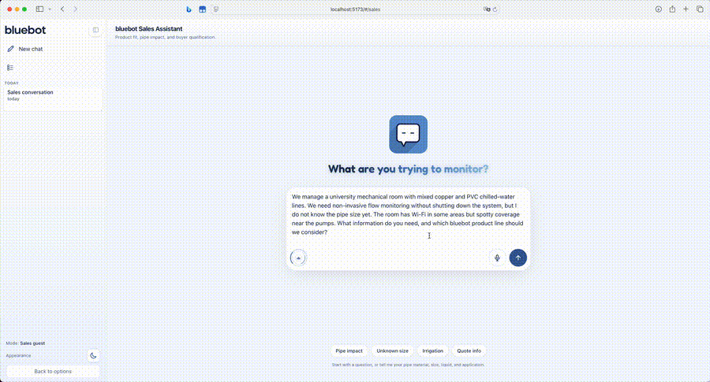

# Sales Agent

The sales agent is a public, pre-login assistant for prospects, buyers, installers, and other users who are still deciding whether a bluebot ultrasonic flow meter fits their site.

It should educate clearly, ask discovery questions before recommending, and end with a structured lead summary rather than only a transcript.

## Contents

- [Purpose](#purpose)
- [UI preview](#ui-preview)
- [Conversation behavior](#conversation-behavior)
- [Tools and guardrails](#tools-and-guardrails)
- [Knowledge base and product links](#knowledge-base-and-product-links)
- [API routes](#api-routes)
- [Frontend behavior](#frontend-behavior)
- [Persistence and sharing](#persistence-and-sharing)
- [Test coverage](#test-coverage)

<a id="purpose"></a>

## Purpose

The public sales assistant lives inside the existing FastAPI orchestrator and frontend. It does not run as a separate service or on a separate port.

Responsibilities:

- Explain ultrasonic flow-meter fit, installation, pipe compatibility, and non-invasive pipe impact.
- Qualify industry/application, pipe details, flow expectations, liquid type, environment, power/network availability, reporting needs, timeline, and purchasing role.
- Recommend relevant product lines from the curated local catalog when enough information is available.
- Link users to relevant bluebot pages when the KB/catalog includes reviewed URLs.
- Capture a structured lead summary that can be shared internally.

Non-responsibilities:

- No pricing automation in V1.
- No calendar booking in V1.
- No live account/device lookup.
- No pipe configuration writes.
- No MQTT or protected admin operations.

<a id="ui-preview"></a>

## UI preview

<p>
  
</p>

Full sales chat workflow:

<p>
  
</p>

<a id="conversation-behavior"></a>

## Conversation behavior

The sales prompt lives at [`../orchestrator/prompts/sales_system_v1.md`](../orchestrator/prompts/sales_system_v1.md).

The assistant should ask for discovery before recommending:

- Industry and application.
- Pipe material, pipe size, and accessibility.
- Expected flow range.
- Water/liquid type.
- Installation environment.
- Power and network availability.
- Accuracy, reporting, and integration needs.
- Timeline and purchasing role.

It should answer educational questions first, then steer back to qualification. When confidence is low, it should name what is missing rather than guessing.

When a customer asks for human support, a person, a callback, sales review, quote help, or help beyond public sales chat, the prompt instructs the assistant to hand off to Denis Zaff at 4085858829 or denis@bluebot.com while still answering general public-sales questions it can safely handle.

<a id="tools-and-guardrails"></a>

## Tools and guardrails

Sales-only tools live in [`../orchestrator/sales_chat/tools.py`](../orchestrator/sales_chat/tools.py):

| Tool | Purpose |
|------|---------|
| `search_sales_kb` | Retrieve curated product/industry/installation context. |
| `qualify_meter_use_case` | Convert user context into a qualification snapshot. |
| `assess_pipe_fit` | Reason about pipe material, size, accessibility, and fit risks. |
| `explain_installation_impact` | Explain clamp-on/non-invasive installation and pipe impact. |
| `capture_lead_summary` | Persist a structured lead object. |
| `recommend_product_line` | Recommend product-line candidates from the curated catalog. |

Sales mode must not expose live Bluebot device/account tools, flow-analysis subprocesses, pipe configuration writes, or MQTT actions. The allowlist is enforced in [`../orchestrator/sales_chat/agent.py`](../orchestrator/sales_chat/agent.py) and covered by tests.

Final sales answers are checked before they are shown to the customer. The
assistant first generates a draft privately, then [`../orchestrator/sales_chat/verifier.py`](../orchestrator/sales_chat/verifier.py)
classifies whether the response needs evidence-backed validation. General
greetings, clarification questions, lead-summary acknowledgements, and safe
off-topic redirects use the default rough deterministic check. Product, pipe-fit,
compatibility, installation, support, pricing/package, connectivity, capability,
recommendation, or evidence-tool claims escalate to the stronger verifier.
Unsupported claims are rewritten and re-checked up to
`SALES_RESPONSE_VERIFICATION_ATTEMPTS` times.

By default this follows a "fast drafter, stronger validator" pattern:

- `claude-haiku-4-5` drafts are validated by `claude-sonnet-4-6`.
- `gpt-4o-mini` drafts are validated by `gpt-4o`.
- Gemini Flash drafts are validated by `gemini-2.5-pro`.

The verifier model can be set with `SALES_RESPONSE_VERIFIER_MODEL`, but a weaker
override is ignored unless `SALES_RESPONSE_ALLOW_WEAKER_VERIFIER=true` is set for
a controlled local experiment. Verification can be disabled only for controlled
development with `SALES_RESPONSE_VERIFICATION=off`.
`SALES_RESPONSE_GENERAL_VALIDATION` controls general replies: `rough` is the
default, `strong` preserves always-strong verification, and `skip` suppresses
general validation while still escalating detected factual claims. Customers may
see safe validation status events such as "checking against Bluebot public
website knowledge", but they should not see unverified drafts or internal
reasoning.

<a id="knowledge-base-and-product-links"></a>

## Knowledge base and product links

Sales content is loaded from the runtime database when synced records exist, with
the checked-in JSON files as bootstrap/fallback:

- [`../orchestrator/sales_kb/articles.json`](../orchestrator/sales_kb/articles.json) contains reviewed educational and product-fit content.
- [`../orchestrator/sales_kb/product_catalog.json`](../orchestrator/sales_kb/product_catalog.json) contains product-line information and reviewed links.

The sales chat itself intentionally avoids live web browsing. To keep the runtime
KB fresh, run the controlled website sync:

```bash
python -m orchestrator.sales_content_sync --run-once
```

Without `--run-once`, the same entrypoint runs a daily loop by default. It fetches
only `www.bluebot.com`, `support.bluebot.com`, and `help.bluebot.com`, rejects
off-domain redirects, redacts pricing/package text from answerable content, and
keeps the previous known-good DB record when a page fails validation.

Useful content categories:

- Product fit.
- Installation requirements.
- Pipe compatibility.
- Flow-meter education.
- Effect on pipes and non-invasive positioning.
- Network, power, and environment constraints.
- Buyer qualification questions.
- Product-line recommendation hints.

<a id="api-routes"></a>

## API routes

Public sales routes live under `/api/public/sales/...` in [`../orchestrator/api.py`](../orchestrator/api.py):

| Route | Purpose |
|-------|---------|
| `POST /api/public/sales/conversations` | Create a public sales conversation. |
| `GET /api/public/sales/conversations?ids=...` | Load known sales conversations for sidebar history. |
| `GET /api/public/sales/conversations/{id}` | Load one sales conversation. |
| `PATCH /api/public/sales/conversations/{id}` | Rename/update sales conversation metadata. |
| `DELETE /api/public/sales/conversations/{id}` | Delete a sales conversation. |
| `POST /api/public/sales/conversations/{id}/chat` | Send a sales message and create a stream. |
| `GET /api/public/sales/conversations/{id}/status` | Recover in-flight status after switching conversations or refreshing. |
| `GET /api/public/sales/streams/{stream_id}` | Stream sales events. |
| `GET /api/public/sales/streams/{stream_id}/poll` | Poll missed stream events during recovery. |
| `POST /api/public/sales/conversations/{id}/cancel` | Cancel an in-flight sales response. |
| `POST /api/public/sales/conversations/{id}/share` | Create a read-only share snapshot. |
| `DELETE /api/public/sales/shares/{token}` | Revoke a sales share link with its revoke key. |

Frontend API helpers live in [`../frontend/src/api/client.ts`](../frontend/src/api/client.ts).

<a id="frontend-behavior"></a>

## Frontend behavior

The sales UI lives in [`../frontend/src/features/sales/SalesChatPage.tsx`](../frontend/src/features/sales/SalesChatPage.tsx) and should visually match the admin assistant:

- Same sidebar treatment.
- Conversation history.
- New chat behavior.
- Running status.
- Disabled input while the active or another sales conversation is processing.
- Stop button.
- Share link action.
- Compact lead-summary panel once qualification data exists.

Shared UI pieces:

- [`../frontend/src/features/chat/components/ChatView.tsx`](../frontend/src/features/chat/components/ChatView.tsx)
- [`../frontend/src/features/conversations/components/Sidebar.tsx`](../frontend/src/features/conversations/components/Sidebar.tsx)
- [`../frontend/src/features/share/components/SharePopover.tsx`](../frontend/src/features/share/components/SharePopover.tsx)
- [`../frontend/src/core/turnActivity.ts`](../frontend/src/core/turnActivity.ts)

<a id="persistence-and-sharing"></a>

## Persistence and sharing

Conversation IDs are tracked in browser storage for sidebar restoration, but conversation bodies and summaries are persisted server-side through [`../orchestrator/store.py`](../orchestrator/store.py).

Important behavior:

- Closing and reopening the browser should restore known sales conversations when the server database still has them.
- Switching conversations should not lose the in-flight status of another sales conversation.
- Refreshing during generation should recover stream status through the public status endpoint.
- Share links are read-only snapshots; revocation requires the generated revoke key.

<a id="test-coverage"></a>

## Test coverage

Sales tests live in [`../tests/orchestrator/test_sales_agent.py`](../tests/orchestrator/test_sales_agent.py).

Covered areas include:

- Sales routing cannot call status, flow, pipe configuration, or MQTT tools.
- KB retrieval for known product/pipe questions.
- Product-line recommendation output.
- Lead qualification and summary persistence.
- Public API does not require Auth0 and does not expose protected data.
- Conversation CRUD.
- Share snapshot creation/revocation.
- Cancel and status recovery endpoints.
- SQLite volume-directory handling for Railway.
